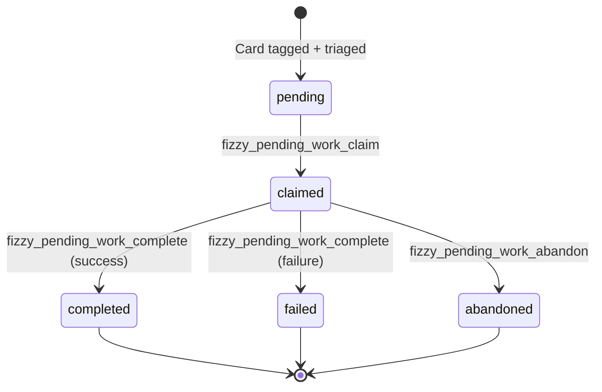

# Pending Work Tools

The pending work tools enable AI agents to interact with the work queue — the backbone of [Vibe Coding](/vibe-coding/).

## Work Item Lifecycle



## Tools

### `fizzy_pending_work_list`

List work items in the AI queue.

**Parameters:**

| Parameter | Type | Required | Description |
|-----------|------|----------|-------------|
| `status` | `string` | No | Filter by status: `pending`, `claimed`, `completed`, `failed`, `abandoned`. Default: `pending` |
| `board_id` | `string` | No | Filter by board ID |
| `mode` | `string` | No | Filter by work mode: `code` or `plan` |
| `limit` | `number` | No | Max items to return (1-100). Default: 10 |

**Example:**
```
fizzy_pending_work_list
Parameters: { status: "pending", mode: "code" }

Returns: {
  items: [
    { id: "work_123", card_number: 42, card_title: "Add dark mode", mode: "code", status: "pending" }
  ],
  count: 1
}
```

---

### `fizzy_pending_work_get`

Get detailed information about a specific work item.

**Parameters:**

| Parameter | Type | Required | Description |
|-----------|------|----------|-------------|
| `work_id` | `string` | Yes | The work item ID |

**Example:**
```
fizzy_pending_work_get
Parameters: { work_id: "work_123" }

Returns: Full work item with metadata, timestamps, and error info
```

---

### `fizzy_pending_work_claim`

Claim a pending work item to start processing it. This prevents other agents from picking it up.

**Parameters:**

| Parameter | Type | Required | Description |
|-----------|------|----------|-------------|
| `work_id` | `string` | Yes | The work item ID to claim |
| `agent_id` | `string` | No | Agent identifier (auto-generated if omitted) |

**Example:**
```
fizzy_pending_work_claim
Parameters: { work_id: "work_123" }

Returns: {
  work_id: "work_123",
  card_number: 42,
  card_title: "Add dark mode",
  mode: "code",
  claimed_by: "claude-abc123",
  next_steps: [
    "Get card details: fizzy_get_card with card_number=42",
    "Implement the requested changes and create a PR",
    "Mark complete: fizzy_pending_work_complete"
  ]
}
```

**Errors:**
- `404` — Work item not found
- `409` — Already claimed by another agent

---

### `fizzy_pending_work_complete`

Mark a claimed work item as completed or failed.

**Parameters:**

| Parameter | Type | Required | Description |
|-----------|------|----------|-------------|
| `work_id` | `string` | Yes | The work item ID |
| `success` | `boolean` | Yes | Whether the work completed successfully |
| `error` | `string` | No | Error message (when `success: false`) |

**Example (success):**
```
fizzy_pending_work_complete
Parameters: { work_id: "work_123", success: true }
```

**Example (failure):**
```
fizzy_pending_work_complete
Parameters: { work_id: "work_123", success: false, error: "Tests failed: 3 assertions" }
```

---

### `fizzy_pending_work_abandon`

Release a claimed work item so another agent can pick it up.

**Parameters:**

| Parameter | Type | Required | Description |
|-----------|------|----------|-------------|
| `work_id` | `string` | Yes | The work item ID to abandon |

**Example:**
```
fizzy_pending_work_abandon
Parameters: { work_id: "work_123" }
```

---

### `fizzy_pending_work_status`

Get a summary of the work queue.

**Parameters:** None

**Example:**
```
fizzy_pending_work_status

Returns: {
  counts: { pending: 3, claimed: 1, completed: 12, failed: 0, abandoned: 1 },
  total: 17,
  has_pending_work: true
}
```

## Typical Workflow

```
1. fizzy_pending_work_list          → Find available work
2. fizzy_pending_work_claim         → Lock a work item
3. fizzy_get_card                   → Read card details
4. [implement changes, commit, PR]  → Do the work
5. fizzy_pending_work_complete      → Mark done
6. fizzy_close_card                 → Close the card
7. Repeat from step 1
```

## How Work Gets Queued

Work items are created automatically when:
- A card with `#ai-code` or `#ai-plan` tag is moved to a trigger column (`To Do`, `Ready`, `Accepted`)
- A webhook fires for a card triage or tag event
- Cards are closed or postponed — their pending work is cancelled

See [Workflow Columns](/vibe-coding/columns) for details on trigger columns.
