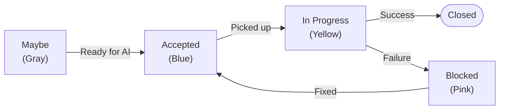

# Workflow Columns

Vibe Coding uses board columns to track the state of cards as they move through the autonomous development pipeline.

## Standard Columns

Four columns define the Vibe Coding workflow:



### Maybe (Gray)

**Purpose**: Staging area for ideas and cards not ready for AI work.

Cards in Maybe are:
- Visible to the team for discussion
- Ignored by Vibe Coding
- Safe to tag with `#ai-code` or `#ai-plan` before they're ready

**When to use**: Add cards here when brainstorming or when requirements aren't finalized.

### Accepted (Blue)

**Purpose**: Queue of cards ready for AI to pick up.

Cards in Accepted:
- Must have `#ai-code` or `#ai-plan` tag
- Are picked up in order (oldest first)
- Move to "In Progress" automatically when work begins

**When to use**: Move cards here when requirements are clear and you want the AI to implement them.

### In Progress (Yellow)

**Purpose**: Cards the AI is actively working on.

Cards in In Progress:
- Have an active Claude Code session
- Should not be manually moved or edited
- Include progress comments from the AI

**When to use**: Don't manually move cards here — Vibe Coding manages this column.

### Blocked (Pink)

**Purpose**: Cards that failed and need human intervention.

Cards in Blocked:
- Had an error during implementation
- Include diagnostic comments from the AI
- Need manual review before retrying

**When to use**: Review the card, fix issues, then move back to Accepted to retry.

## Card Lifecycle

A card's journey through Vibe Coding:


### 1. Card Creation

Create a card with clear requirements:
- Descriptive title
- Detailed description with acceptance criteria
- Tag with `#ai-code` or `#ai-plan`

### 2. Triage Decision

Decide when the card is ready:
- **Not ready** → Move to Maybe
- **Ready** → Move to Accepted

### 3. AI Pickup

When Vibe Coding finds a ready card:
1. Moves card to "In Progress"
2. Adds comment: "Starting work on this card..."
3. Creates feature branch
4. Spawns Claude Code

### 4. Implementation

Claude Code works on the card:
- Reads card description for requirements
- Makes code changes
- Runs tests
- Commits with meaningful messages

### 5. PR Creation

On successful implementation:
1. Pushes branch to GitHub
2. Creates pull request
3. Adds comment with PR link
4. Closes the card

### 6. Failure Handling

If something goes wrong:
1. Moves card to "Blocked"
2. Adds comment with error details
3. Continues to next card

## Auto-Column Creation

If standard columns don't exist when you start Vibe Coding, they're created automatically:

```bash
$ npx fizzy-do-mcp --vibe

Creating missing columns...
  ✓ Created "Maybe" (Gray)
  ✓ Created "Accepted" (Blue)  
  ✓ Created "In Progress" (Yellow)
  ✓ Created "Blocked" (Pink)

Ready to vibe!
```

Existing columns with matching names (case-insensitive) are reused.

## Column Matching Rules

Vibe Coding finds columns by name with fuzzy matching:

| Looking for | Matches |
|-------------|---------|
| Maybe | "Maybe", "maybe", "MAYBE", "Maybe Later" |
| Accepted | "Accepted", "accepted", "Ready", "To Do" |
| In Progress | "In Progress", "in-progress", "Doing", "WIP" |
| Blocked | "Blocked", "blocked", "Failed", "Needs Help" |

::: tip Custom Names
If you prefer different column names, the fuzzy matcher usually finds them. For guaranteed matching, use the exact standard names.
:::

## Column Colors

Colors provide visual feedback on card status:

| Column | Color | CSS Variable |
|--------|-------|--------------|
| Maybe | Gray | `var(--color-card-1)` |
| Accepted | Blue | `var(--color-card-default)` |
| In Progress | Yellow | `var(--color-card-3)` |
| Blocked | Pink | `var(--color-card-8)` |

## Multiple AI Cards

By default, Vibe Coding processes one card at a time. This ensures:
- Clear git history
- No merge conflicts
- Predictable behavior

Cards wait in "Accepted" and are picked up in creation order (oldest first).

## Manual Intervention

You can always intervene in the workflow:

### Moving Cards Back

If a card was picked up by mistake:
1. Wait for current work to finish (or stop Vibe Coding)
2. Move the card back to "Maybe" or "Accepted"
3. Remove the tag if needed

### Skipping Cards

To skip a card temporarily:
1. Remove the `#ai-code` / `#ai-plan` tag
2. Or move to "Maybe"

### Retrying Failed Cards

When a card lands in "Blocked":
1. Read the AI's diagnostic comment
2. Fix the underlying issue (missing test, unclear requirements, etc.)
3. Update the card description if needed
4. Move back to "Accepted"
