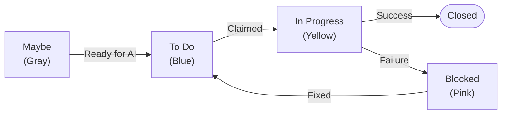
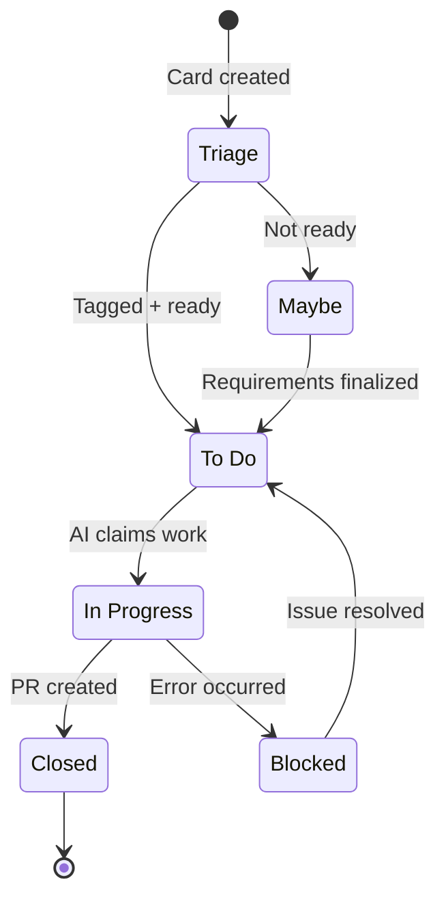

# Workflow Columns

Vibe Coding uses board columns to track the state of cards as they move through the autonomous development pipeline.

## Standard Columns

Four columns define the Vibe Coding workflow:

### To Do (Blue)

**Purpose**: Queue of cards ready for AI to pick up. This is the primary trigger column.

Cards in To Do:
- Must have `#ai-code` or `#ai-plan` tag
- Are picked up in order (oldest first)
- Move to "In Progress" when work is claimed

**When to use**: Move cards here when requirements are clear and you want the AI to implement them.

::: tip Alternative Trigger Columns
`Ready` and `Accepted` also work as trigger columns. Use whichever name fits your workflow.
:::

### Maybe (Gray)

**Purpose**: Staging area for ideas and cards not ready for AI work.

Cards in Maybe are:
- Visible to the team for discussion
- Ignored by Vibe Coding
- Safe to tag with `#ai-code` or `#ai-plan` before they're ready

**When to use**: Add cards here when brainstorming or when requirements aren't finalized.

### In Progress (Yellow)

**Purpose**: Cards the AI is actively working on.

Cards in In Progress:
- Have been claimed from the work queue
- Have an active AI session implementing them
- Include progress comments from the AI

**When to use**: Don't manually move cards here — Vibe Coding manages this column.

### Blocked (Pink)

**Purpose**: Cards that failed and need human intervention.

Cards in Blocked:
- Had an error during implementation
- Include diagnostic comments from the AI
- Need manual review before retrying

**When to use**: Review the card, fix issues, then move back to To Do to retry.

## Card Lifecycle

A card's journey through Vibe Coding:

### 1. Card Creation

Create a card with clear requirements:
- Descriptive title
- Detailed description with acceptance criteria
- Tag with `#ai-code` or `#ai-plan`

### 2. Triage Decision

Decide when the card is ready:
- **Not ready** — Move to Maybe
- **Ready** — Move to To Do

### 3. AI Claims Work

When your AI assistant checks the work queue:
1. Finds the card via `fizzy_pending_work_list`
2. Claims it via `fizzy_pending_work_claim`
3. Moves card to "In Progress"
4. Adds comment: "Starting work on this card..."

### 4. Implementation

The AI works on the card:
- Reads card description for requirements
- Makes code changes
- Runs tests
- Commits with meaningful messages

### 5. PR Creation

On successful implementation:
1. Pushes branch to GitHub
2. Creates pull request
3. Adds comment with PR link
4. Marks work complete via `fizzy_pending_work_complete`
5. Closes the card

### 6. Failure Handling

If something goes wrong:
1. Marks work as failed or abandoned
2. Moves card to "Blocked"
3. Adds comment with error details
4. Continues to next card

## Work Queue Statuses

The underlying work queue tracks items through these statuses:

| Status | Meaning |
|--------|---------|
| `pending` | Queued, waiting to be claimed |
| `claimed` | AI has picked up the work |
| `completed` | Successfully finished |
| `failed` | Error during processing |
| `abandoned` | Released back to queue |

## Column Matching Rules

Vibe Coding finds trigger columns by name (case-insensitive):

| Column Name | Triggers Work? |
|-------------|----------------|
| To Do | Yes |
| Todo | Yes |
| Ready | Yes |
| Accepted | Yes |
| Maybe | No |
| In Progress | No |
| Blocked | No |

## Multiple AI Cards

By default, Vibe Coding processes one card at a time. This ensures:
- Clear git history
- No merge conflicts
- Predictable behavior

Cards wait in the queue and are picked up in creation order (oldest first).

## Manual Intervention

You can always intervene in the workflow:

### Moving Cards Back

If a card was picked up by mistake:
1. Wait for current work to finish
2. Move the card back to "Maybe"
3. Remove the tag if needed

### Skipping Cards

To skip a card temporarily:
1. Remove the `#ai-code` / `#ai-plan` tag
2. Or move to "Maybe"

### Retrying Failed Cards

When a card lands in "Blocked":
1. Read the AI's diagnostic comment
2. Fix the underlying issue (missing test, unclear requirements, etc.)
3. Update the card description if needed
4. Move back to "To Do"
