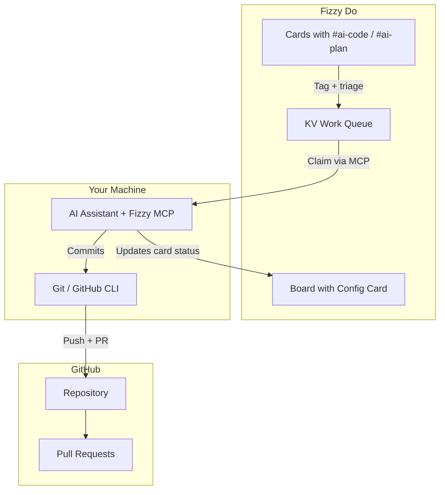

# Vibe Coding

Vibe Coding is Fizzy Do's autonomous AI coding mode. Point it at a board, tag your cards, and let your AI assistant pick up work, implement features, and create pull requests while you focus on high-level decisions.

## What is Vibe Coding?

Traditional AI-assisted development requires constant interaction: you prompt, the AI responds, you review, repeat. Vibe Coding flips this model. Instead of driving the AI, you manage a backlog of cards and let the AI drive itself.

The AI acts like an autonomous developer:

1. **Checks the work queue** for cards tagged `#ai-code` or `#ai-plan`
2. **Claims work** from the pending queue
3. **Implements changes** using your AI editor (Claude Code, Cursor, etc.)
4. **Creates pull requests** with comprehensive documentation
5. **Marks work complete** and moves to the next card

You stay in control through your board — prioritize cards, add context in descriptions, and review PRs when ready.

## Key Features

### MCP-Native Workflow

Vibe Coding works directly through MCP tools — no separate CLI mode, no WebSocket connections. Your AI assistant uses the same Fizzy MCP tools it already has to claim and process work items.

### Two Operating Modes

| Tag | Behavior |
|-----|----------|
| `#ai-code` | Implements the card directly — writes code, tests, and creates a PR |
| `#ai-plan` | Plans first, breaks down into subtasks, then implements each piece |

### High-Quality PR Documentation

Every PR includes:
- Summary of changes
- Link back to the Fizzy card
- Implementation notes
- Test coverage details

### Work Queue Management

Work items flow through clear statuses:

```
pending → claimed → completed (or failed / abandoned)
```

Cards wait in the queue and are processed one at a time, ensuring clean git history and no merge conflicts.

## Architecture



## How It Works

1. **Configuration**: Create a config card on your board linking it to a GitHub repository
2. **Tagging**: Tag cards with `#ai-code` (implement) or `#ai-plan` (plan then implement)
3. **Triaging**: Move tagged cards to a trigger column (`To Do`, `Ready`, or `Accepted`)
4. **Processing**: Tell your AI assistant to start vibe coding — it claims and processes work
5. **Monitoring**: Watch as cards are completed and PRs appear

## When to Use Vibe Coding

**Great for:**
- Feature backlogs with clear requirements
- Bug fixes with reproduction steps
- Refactoring tasks
- Test coverage improvements
- Documentation updates

**Less suited for:**
- Exploratory work without clear goals
- Tasks requiring real-time collaboration
- Security-sensitive changes
- Work needing human judgment calls

## Quick Start

Ready to try it? Follow the [Setup Guide](./setup) to configure your first vibe coding board.

```
You: Let's start vibe coding with Fizzy

AI: [checks pending work queue]
    Found 2 items ready:
    - #42 "Add dark mode" (ai-code, pending)
    - #43 "Refactor auth" (ai-plan, pending)

    Claiming #42...
    [implements, commits, opens PR]
    Done! Marked #42 complete. Moving to #43...
```
