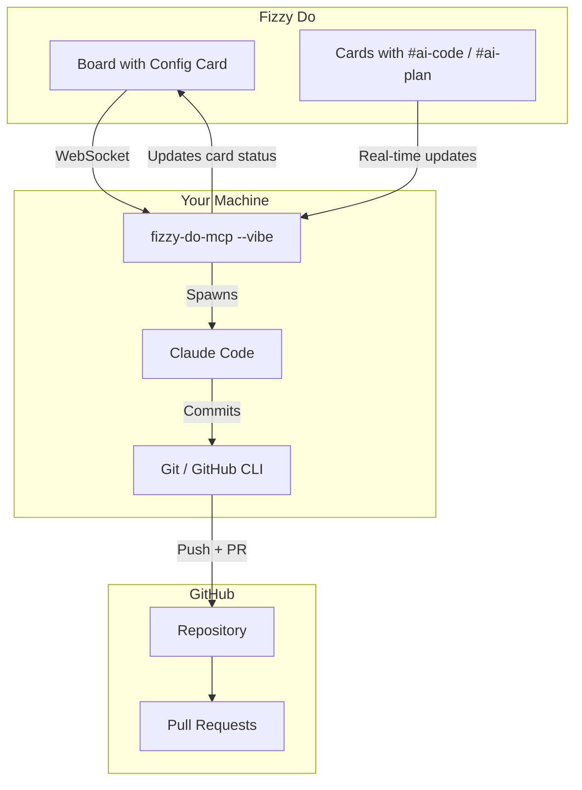

# Vibe Coding

Vibe Coding is Fizzy Do's autonomous AI coding mode — a fairly eager Product Manager that loves to vibe code. Point it at a board, and it will continuously pick up cards, implement features, and create pull requests while you focus on other things.

## What is Vibe Coding?

Traditional AI-assisted development requires constant interaction: you prompt, the AI responds, you review, repeat. Vibe Coding flips this model. Instead of driving the AI, you manage a backlog of cards and let the AI drive itself.

The AI acts like an autonomous developer:

1. **Monitors your board** for cards tagged `#ai-code` or `#ai-plan`
2. **Picks up work** from the "Accepted" column
3. **Implements changes** using Claude Code
4. **Creates pull requests** with comprehensive documentation
5. **Moves to the next card** and repeats

You stay in control through your board — prioritize cards, add context in descriptions, and review PRs when ready.

## Key Features

### Autonomous Card Pickup

Vibe Coding continuously watches your board for work. When a card with `#ai-code` or `#ai-plan` lands in the "Accepted" column, it's automatically picked up and moved to "In Progress."

### Two Operating Modes

| Tag | Behavior |
|-----|----------|
| `#ai-code` | Implements the card directly — writes code, tests, and creates a PR |
| `#ai-plan` | Plans first, breaks down into subtasks, then implements each piece |

### High-Quality PR Documentation

Every PR includes:
- Summary of changes
- Link back to the Fizzy card
- Implementation notes
- Test coverage details

### Board Continuation

Vibe Coding doesn't stop after one card. It continues processing your backlog until:
- No more cards are available
- A card fails and lands in "Blocked"
- You stop the process

## Architecture



## How It Works

1. **Configuration**: Create a config card on your board linking it to a GitHub repository
2. **Tagging**: Tag cards with `#ai-code` (implement) or `#ai-plan` (plan then implement)
3. **Triaging**: Move tagged cards to the "Accepted" column when ready
4. **Running**: Start vibe mode with `npx fizzy-do-mcp --vibe`
5. **Monitoring**: Watch as cards move through columns and PRs appear

## When to Use Vibe Coding

**Great for:**
- Feature backlogs with clear requirements
- Bug fixes with reproduction steps
- Refactoring tasks
- Test coverage improvements
- Documentation updates

**Less suited for:**
- Exploratory work without clear goals
- Tasks requiring real-time collaboration
- Security-sensitive changes
- Work needing human judgment calls

## Quick Start

Ready to try it? Follow the [Setup Guide](./setup) to configure your first vibe coding board.

```bash
# Install and configure
npx fizzy-do-mcp@latest configure

# Start vibe coding
npx fizzy-do-mcp --vibe
```
